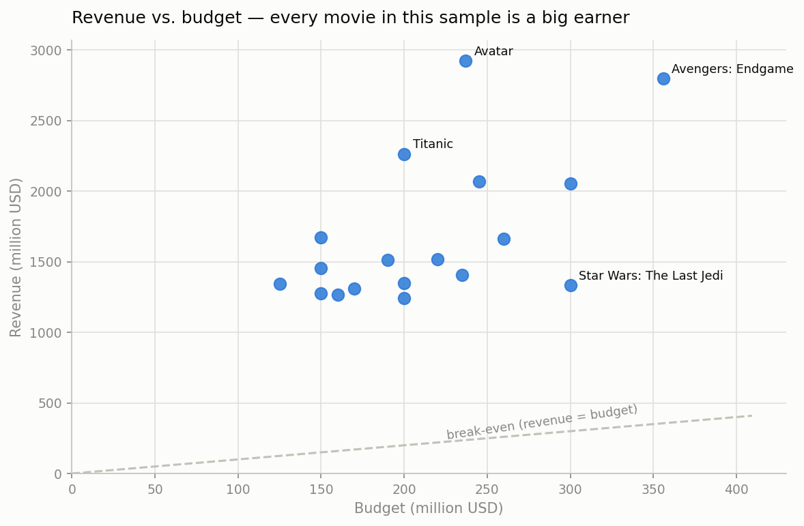
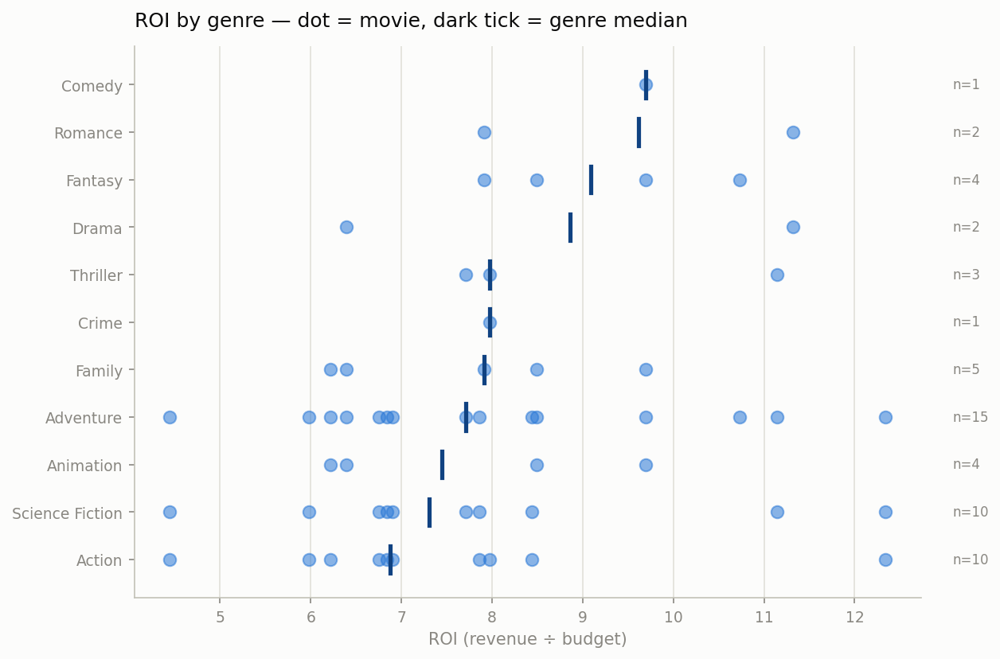
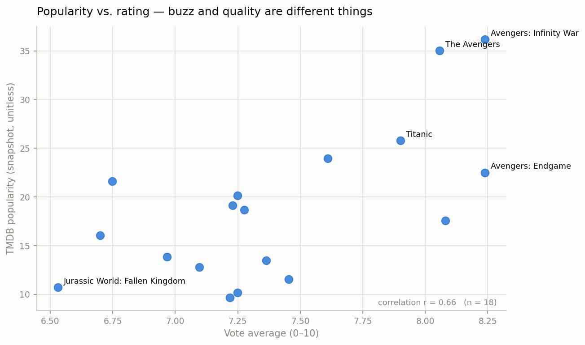
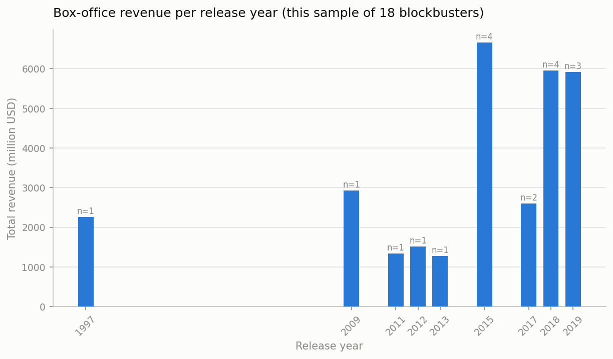
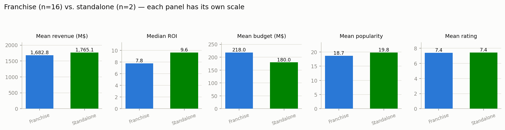

# TMDB Movie Data Analysis — Final Report

**Author:** Joseph Forson
**Data:** TMDB API, 18 movies (19 requested ids; id `0` is invalid and was skipped), snapshot taken 2026-07-18.

---

## 1. Methodology

The project is a four-stage pipeline; each stage reads the previous stage's output, so
the API is hit exactly once and every later step is reproducible offline.

| Stage | Notebook | Output |
|---|---|---|
| Extraction | `01_data_extraction` | `data/raw/movies_raw.json` (immutable raw API responses) |
| Cleaning | `02_data_cleaning` | `data/processed/movies_clean.csv` (18 × 22, validated) |
| KPI analysis | `03_kpi_analysis` | ranking & aggregation tables |
| Visualization | `04_visualization` | five figures in `reports/figures/` |

Reusable logic lives in `src/` (API client, cleaning pipeline, ranking UDF, plot style)
and is covered by **22 unit tests** plus validation checks at the pipeline boundary
(unique ids, positive budgets, correct dtypes and column order).

Key cleaning decisions:

- **Nested JSON flattened** to `|`-separated strings (genres, cast, companies, countries, languages).
- **Zeros treated as missing.** A budget/revenue/runtime of 0 means "unknown", not "free" —
  left in place it would poison every mean and ROI, so it becomes `NaN`.
- **Ratings with `vote_count = 0` invalidated** — an average over zero votes is noise.
- **Co-directors kept.** Four movies are co-directed (both Avengers by the Russo brothers,
  both Frozen films by Buck & Lee). Keeping only the first credited director split those
  duos' track records across half-rows; the pipeline now stores all directors and the
  analysis credits each person per movie (`.explode()`).
- **Metric definition:** ROI = revenue ÷ budget, as the project brief specifies (a value of 12
  means the film grossed 12× its budget). The classic finance definition, (revenue − budget) ÷ budget,
  is exactly this minus 1 and produces identical rankings.

## 2. Key findings

### Financial champions

| KPI | Winner | Value |
|---|---|---|
| Highest revenue | Avatar | $2,923.7M |
| Highest profit | Avatar | $2,686.7M |
| Highest ROI (budget ≥ $10M) | Avatar | 12.3× |
| Highest budget | Avengers: Endgame | $356M |
| Most voted | The Avengers | 38,783 votes |
| Highest rated (≥ 10 votes) | Endgame / Infinity War | 8.24 |
| Most popular (snapshot) | Avengers: Infinity War | 36.2 |

Avatar takes a triple crown — highest revenue, profit **and** ROI — earning more than
Endgame on two-thirds of its budget.

### Spending more doesn't buy more

Budgets cluster in a narrow band (125–360 M$) while revenue spans 1.2–2.9 B$. Within
this elite sample, budget is a weak predictor: Star Wars: The Last Jedi spent $300M for
$1.33B, while Titanic turned $200M into $2.26B.

### ROI by genre — beware small n

Comedy and Romance top the medians, but they rest on one and two movies respectively.
The well-represented genres (Adventure n=15, Action and Science Fiction n=10) cluster
around ROI 7–8. Sample size is printed on the chart because medians of two points are
anecdotes, not statistics.

### Buzz and quality are different things

TMDB popularity correlates only moderately with rating (r = 0.66, n = 18). Popularity is
TMDB's internal, time-varying engagement score — unitless, recalculated daily, snapshot
taken at extraction time. It ranks current platform buzz, not box office or quality
(2012's The Avengers nearly ties 2018's Infinity War).

### Yearly box office

2015 is the sample's peak year ($6.7B across 4 movies), with 2018–2019 close behind. Bar
height tracks how many top movies the sample has per year as much as any industry trend —
the gaps (1998–2008) are gaps in the sample, not in cinema history.

### Franchise vs. standalone

The two standalones (Titanic, Beauty and the Beast) edge out the 16 franchise movies on
mean revenue ($1,765M vs $1,683M) and median ROI (9.6 vs 7.8) while costing less to make
($180M vs $218M mean budget). Ratings and popularity are essentially tied.

### Directors

James Cameron leads with $5.19B over 2 movies; the Russo brothers follow at $4.85B over 2
(and the highest mean rating, 8.24). Note this ranking *changed* after the co-director fix —
before it, the Russos appeared as two unrelated one-movie directors.

## 3. Caveats — what this data can and cannot say

1. **Selection bias.** These 18 movies are hand-picked global mega-hits. Every conclusion
   describes *this sample*; none generalizes to "movies" — e.g. the standalone-beats-franchise
   result is driven entirely by Titanic and would likely reverse on a random sample.
2. **Popularity is a moving snapshot** — values from another date are not comparable
   (TMDB has renormalized the metric's scale over time).
3. **Tiny groups.** Standalone n=2; several genres n≤2. Medians shown, means avoided where
   outliers dominate.

## 4. Conclusion

A four-stage, tested, reproducible pipeline turned raw nested API JSON into validated
KPIs and honest visualizations. The technical takeaways match the analytical ones:
freeze raw data, make missing values explicit, pin metric definitions in writing, and
check group sizes before believing any aggregate.
